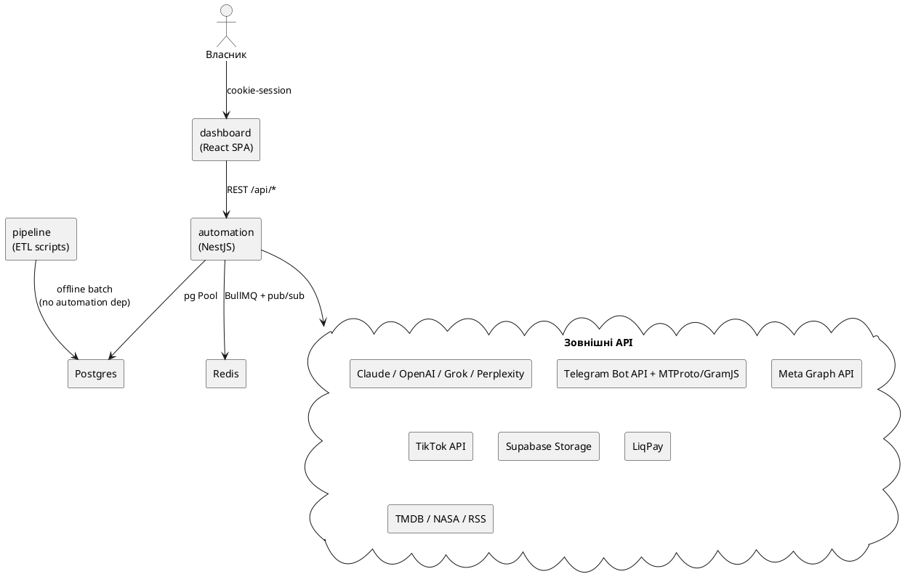
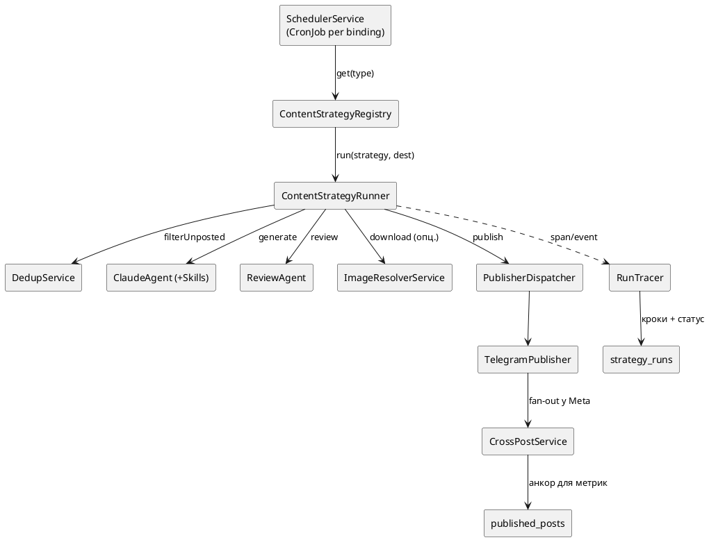
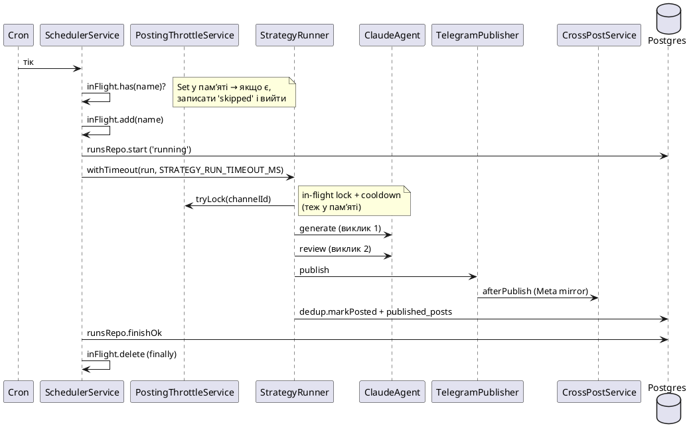

# 02 · Архітектура

## 2.1 Монорепо: 3 застосунки

| App | Що це | Стек | Роль |
|---|---|---|---|
| **apps/automation** | «мозок» системи | NestJS 10, `pg`, ioredis, BullMQ, `@nestjs/schedule` | вся бізнес-логіка: стратегії, публікація, scheduler, tracking, agent, payments |
| **apps/dashboard** | пульт власника | React 18, TanStack Router, Vite, nginx | SPA, ходить у REST automation (cookie-session) |
| **apps/pipeline** | офлайн ETL | standalone Node (ESM, `--env-file`) | scrape/parse/load статичних датасетів у Postgres; **не** довгоживучий сервіс, поза runtime |

## 2.2 Композиційний корінь і модулі

`app.module.ts` реєструє ~30 модулів. Інфраструктурні: `ConfigModule.forRoot` (envFilePath `../../.env`), `ScheduleModule.forRoot`, `DatabaseModule`, `ChannelConfigModule`, `LoggingModule`, `CryptoModule`. Фічеві модулі:

| Модуль | Відповідальність |
|---|---|
| `common/content-strategy` | `ContentStrategy` interface + registry + runner (ядро генерації) |
| `publishers` | `PublisherDispatcher` + `TelegramPublisher`/Facebook/Instagram/Threads/TikTok, `CrossPostService`, `PostingThrottleService` |
| `scheduler` | один `CronJob` на кожен `strategy_bindings` рядок; hot-reload; `RunTracer` |
| `tracking` | MTProto-трекінг конкурентів: `TrackingQueueService` + 4 BullMQ-воркери |
| `discovery` | рекомендації каналів (`RecommendationsService`), `TeleadsIngestionWorker` |
| `stats` | збір метрик Telegram (MTProto) + Meta (Graph API) |
| `scheduled-posts` | ручні пости з дашборду/агента → `ScheduledPostsWorker` (@Cron 30s) |
| `agent` | монетизаційний оператор SP1–SP4 (DM-інбокс, дії, chat-intel) |
| `payments` | LiqPay ad-orders (`AdOrdersService`, `LiqpayService`, публічний callback) |
| `config` | config-in-DB репозиторії + `ConfigCacheService` + Redis hot-reload |
| `settings` | `SettingsService` — DB-override невеликого набору env-налаштувань |
| `auth` | cookie/JWT сесія власника (Telegram-widget або токен) |
| `common/ai` | провайдер-агностичний `ClaudeAgent`/Grok/OpenAI/Perplexity + skills |
| `common/dedup` | `DedupService` (+ `SemanticDedupService`) |
| `database` | єдиний `pg` Pool + `MigrationRunnerService` |

## 2.3 Ключові абстракції (це варто знати команді)

- **`ContentStrategy`** (`content-strategy.interface.ts`) — контракт стратегії: `type`, `supportedPlatforms` (дефолт `['telegram']`), `getSkills(params)`, і головний `execute()`. Реєстр + runner уніфікують запуск.
- **`PublishDestination`** — value object резолвленої цілі: `{ platform, targetId, token?, metaAccountId, postedKey }`. Саме `postedKey` дає **per-destination дедуп** (той самий контент іде і в Telegram, і в IG без колізій).
- **`PublisherDispatcher`** — маршрутизує `publish()`/`publishCarousel()` до потрібного `BasePublisher`.
- **`CrossPostService`** — після Telegram-публікації дзеркалить у `meta_crosspost_targets` (per-account, ізольовано, не кидає помилку нагору).
- **`RunTracer`** — ambient-обсервабіліті на `AsyncLocalStorage`: будь-який сервіс углибині стеку викликає `span()`/`event()` без прокидання аргументів; кроки зберігаються в `strategy_runs.steps` і показуються в дашборді (`/app/logs`).
- **Config-in-DB + Redis hot-reload** — конфіг (боти, канали, binding-и, meta/tiktok акаунти) живе в Postgres, кешується в памʼяті `ConfigCacheService`, інвалідиться через Redis-канал `config:changed`, який публікує `ConfigEventsPublisher` при кожному редагуванні з дашборду. **Редагування конфігу застосовується без рестарту.**

## 2.4 Потік однієї публікації (компонентний вид)

## 2.5 Sequence: один cron-тік стратегії (з усіма гардами)

Це найважливіша діаграма для розуміння **надійності й одноінстансності**:

**Що тут критично:** усі гарди (`inFlight`, `Throttle.locks`, cooldown) — **обʼєкти в памʼяті процесу**. Немає Redis-локу. Тому це працює правильно **лише в одному інстансі** (див. [03](03-data-and-queues.md#стеля-один-інстанс)).

## 2.6 Дашборд ↔ бекенд

Файлові маршрути `apps/dashboard/src/routes/` дзеркалять продуктові поверхні automation 1:1: `app.strategies`, `app.channels`, `app.connections`, `app.logs`, `app.analytics`, `app.scheduled`, `app.compose`, `app.agent`, `app.ads`, `app.settings`. Спілкування — REST через `api/client.ts` (`api<T>()`), сесія — httpOnly-cookie JWT, захищена `TrackingAuthGuard`.
