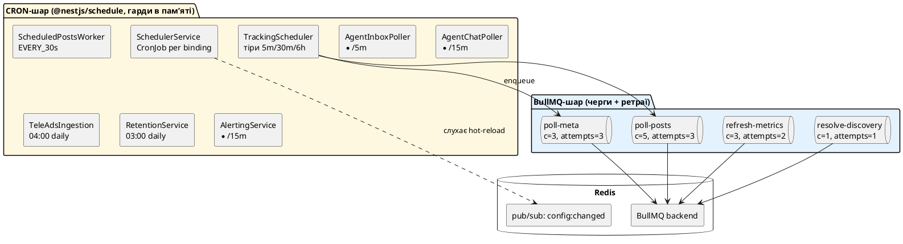
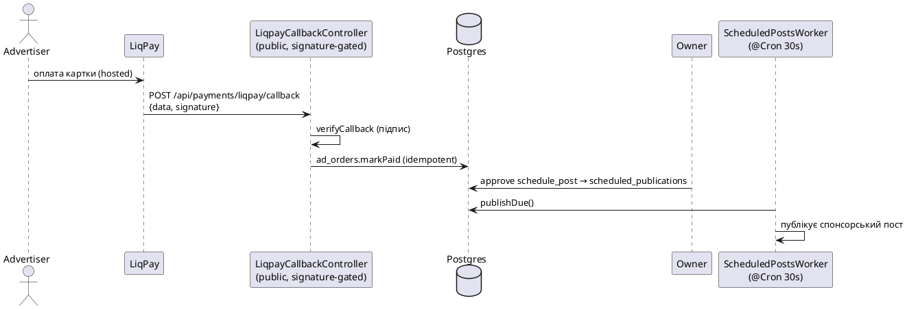

# 03 · Дані, черги та навантаження

## 3.1 База даних: 45 доменних таблиць у 7 доменах

Один Postgres 16, один `pg` Pool, міграції застосовуються на boot (`MigrationRunnerService`, під advisory-lock). Нижче — усі таблиці за доменами, з класом росту (важливо для ретенції).

**Клас росту:** `config` = обмежена/конфіг · `retained` = append-only (підлягає прунінгу) · `unbounded` = append-only без ретенції за замовч. · `history` = зрізи/таймсерії · `snapshot` = один рядок на ключ (upsert).

### 🟢 content — контент-пули (джерела для стратегій)
| Таблиця | Призначення | Ріст / унікальність |
|---|---|---|
| `prompts` | AI-промпти (ai0-prompts/curated) | retained · pk=source id |
| `assets` | Academy / mcpservers / prompts-md | retained · UNIQUE(data_source, title) |
| `recipes` | рецепти + кеш укр. перекладу + БЖВ | retained · UNIQUE(slug) |
| `quotes` | цитати | retained · UNIQUE(text_hash) |
| `facts` | факти | retained · UNIQUE(content_hash) |
| `on_this_day` | історичні події дня | retained · UNIQUE(month, day, slug) |
| `articles` | загальний пул статей | retained · UNIQUE(slug) |
| `tg_posts` | готові HTML-пости (motivation) | retained · UNIQUE(content_hash) |
| `birthdays` | дні народження (motivation) | config · UNIQUE(month, day, name) |
| `pdr_questions` | банк ПДР-питань | config · UNIQUE(question_id) |
| `name_days` | іменини (довідник) | config · UNIQUE(month, day, name) |
| `jokes` | ⚠️ **мертва таблиця** (немає споживачів) | retained · UNIQUE(content_hash) |

### 🔵 publishing — публікації
| Таблиця | Призначення | Ріст |
|---|---|---|
| `published_posts` | 1 рядок на успішну Telegram-публікацію (анкор для метрик) | **unbounded** · UNIQUE(channel_id, message_id) |
| `scheduled_publications` | ручні/агентні заплановані пости (текст/медіа/кнопки) | **unbounded** · partial index на `status`/due |

### 🟣 tracking/analytics — трекінг і метрики
| Таблиця | Призначення | Ріст |
|---|---|---|
| `tracked_channels` | майстер-вузол: свої (`is_mine`) + конкуренти | config · UNIQUE(tg_chat_id) |
| `tracked_posts` | зрізи постів відстежуваних каналів (+ детект реклами) | **unbounded** · UNIQUE(channel_id, tg_message_id) |
| `tracked_post_metrics_history` | таймсерія метрик постів | history · PK(post_id, snapshot_at) |
| `tracked_subs_history` | таймсерія підписників | history · PK(channel_id, snapshot_at) |
| `tracked_ad_edges` | граф «хто в кого рекламувався» | retained · PK(source, target, kind) |
| `post_stats_snapshots` | погодинні метрики своїх постів | retained · таймсерія |
| `channel_stats_snapshots` | погодинні метрики своїх каналів | retained · таймсерія |
| `posted_news` | **глобальний dedup-леджер** новин | **unbounded** · UNIQUE(source_url, channel_id) |
| `meta_follower_history` | таймсерія фоловерів Meta | history · PK(account_id, snapshot_at) |
| `meta_account_insights` | денні інсайти Meta (reach/impressions) | **unbounded** · UNIQUE(account_id, day) |

### 🟠 discovery/ROI
| Таблиця | Призначення | Ріст |
|---|---|---|
| `candidate_channels` | канали, знайдені в каталогах (ще не promoted) | retained · UNIQUE(source, external_id) |
| `tracked_roi_cache` | кеш ROI-аналізу на канал (subs/spend, впевненість) | snapshot · PK=channel_id |

### 🟡 config/auth — конфіг і звʼязки
| Таблиця | Призначення |
|---|---|
| `strategy_bindings` | **серце планування**: стратегія `type` ↔ cron ↔ destination · UNIQUE(ext_id) |
| `my_bots` | Telegram-боти (+ хто дефолтний) · UNIQUE(bot_id) |
| `meta_accounts` | IG/FB/Threads конекшени (token_env або enc-токен) |
| `meta_crosspost_targets` | правила fan-out Telegram→Meta · UNIQUE(channel_id, platform, account_id) |
| `meta_account_groups` | бренд-групи (FB+IG+Threads) · UNIQUE(name) |
| `tiktok_accounts` | TikTok-креатори (токени тепер enc) · UNIQUE(open_id) |
| `telegraph_accounts` | Telegraph-сесії для лонгрідів |
| `mtproto_sessions` | **зашифровані** MTProto-сесії (role: tracker/agent) |
| `forward_routes` | правила форварду між каналами |
| `app_settings` | key/value override env-налаштувань з дашборду |

### ⚙️ ops — журнали й службове
| Таблиця | Призначення | Ріст |
|---|---|---|
| `strategy_runs` | лог кожного запуску стратегії (+ `steps` JSONB) | **unbounded** |
| `ai_logs` | **кожен** AI-виклик: повний промпт+відповідь | **unbounded** (найшвидший ріст) |
| `bot_logs` | success/error на кожну спробу публікації | **unbounded** |
| `schema_migrations` | леджер міграцій | config · PK(version) |

### 🔴 agent-operator + payments (нове, SP1–SP4)
| Таблиця | Призначення |
|---|---|
| `agent_dm_threads` | SP1: 1 рядок на DM-peer · UNIQUE(peer_id) |
| `agent_poll_cursor` | SP1: курсор DM-поллінгу |
| `agent_actions` | SP2: черга дій (reply/schedule_post) за апрувом |
| `agent_monitored_chats` | SP4: allow-list чатів для моніторингу · PK(chat_id) |
| `agent_opportunities` | SP4: стрічка можливостей · UNIQUE(chat_id, message_id) |
| `ad_orders` | SP3: рекламні інвойси · UNIQUE(liqpay_order_id) |

> **Дедуп — це три незалежні шари:** (1) `posted_news` глобально по URL; (2) `posted` JSONB на destination у binding-у; (3) `SemanticDedupService` (дешевий AI-виклик на новизну). Це найскладніша частина мультиканальної публікації — зроблено правильно.

## 3.2 Черги vs крон — два різні механізми без спільної координації

Система **змішує два підходи** до фонової роботи:

- **BullMQ (4 черги)** — лише для **трекінгу конкурентів**: `poll-meta` (c=3), `poll-posts` (c=5, до 50 повідомлень), `refresh-metrics` (c=3), `resolve-discovery` (c=1, без ретраю). Ретраї + експоненційний backoff на рівні черги.
- **Cron (@nestjs/schedule)** — для **всього іншого**: публікація стратегій, тік ручних постів (кожні 30с), агент-поллери, ingestion TeleAds (04:00), ретенція (03:00), алертинг (кожні 15 хв).
- **Redis** грає **дві ролі**: (a) бекенд BullMQ; (b) pub/sub `config:changed` для hot-reload конфігу. **Розподіленого локу немає.**

## 3.3 Стеля «один інстанс» {#стеля-один-інстанс}

> Це **найважливіша архітектурна межа** — команда мусить її знати.

Уся координація конкурентності — **обʼєкти в памʼяті процесу**, а не в Redis:
- `SchedulerService.inFlight` — `Set<string>` активних стратегій;
- `PostingThrottleService.locks` + cooldown — `Set`/`Map` на канал;
- `failOrphanedRunning()` на boot — **перекидає ВСІ рядки `running` → error** (припускає, що жоден інший інстанс легально нічого не виконує);
- єдина `TrackingMtprotoClient` сесія — фактична стеля конкурентності Telegram-читання.

**Наслідок:** якщо запустити **2 інстанси** automation одночасно — обидва крони спрацюють незалежно, обидва пройдуть свої памʼятні гарди → **задвоєні пости**, і кожен на boot повбиває «running» рядки іншого. **JSONB-дедуп не має unique-констрейнту на рівні БД**, тож перекривний тік теж може задвоїти.

**Це підтримуваний режим — рівно 1 інстанс.** Масштабувати горизонтально = переписати шар координації на Redis-локи (Redlock/`SET NX PX`) + partial unique index. Наразі свідомо **не** зроблено (рішення «своя мережа, один оператор»).

## 3.4 Навантаження — реалістична картина

- **Публікація:** cron-вирази зберігаються per-binding у `strategy_bindings`. Кожен тік = 1 пост + опційне дзеркало в Meta. **2 AI-виклики на пост** (generate + review) + опційно semantic-dedup. Обсяг = сума кадженцій binding-ів (десятки постів/день, не тисячі).
- **Трекінг:** тіри — hot (5 хв), warm (30 хв), cold (6 год); батч `TRACKING_BATCH_SIZE`=50. **`TRACKING_ENABLED` за замовч. `false`** — уся BullMQ-підсистема спить, поки не увімкнути в Settings.
- **Агент:** DM-поллер `*/5 хв`, chat-поллер `*/15 хв` (cap `AGENT_CHAT_MAX`=20). **Дешевий пре-фільтр перед AI** — більшість повідомлень відсіюється без виклику Claude. Обидва **off by default**.
- **AI-вартість:** не має жорсткого стелі; пре-фільтри й курсори її обмежують, але не капають. Prompt-кешування **відкладено** (пінната версія SDK не має `cache_control`).

## 3.5 Ретенція (проти безмежного росту)

`RetentionService` (нічний cron 03:00) прунить `unbounded`/`retained` таблиці за політикою (allowlist таблиць/колонок — інʼєкційно-безпечно). **Вимкнено за замовч.** (`RETENTION_ENABLED=false` → лише логує, що видалив би). ⚠️ Поки не увімкнути — `ai_logs` (повні промпти+відповіді) росте безмежно; для довгоживучого одноінстансного деплою це реальний ризик диску.

## 3.6 Sequence: оплата → публікація (конвергенція шляхів)

Важлива точка: **і ручні пости, і агентні `schedule_post`, і оплачені реклами** сходяться в **одному** `ScheduledPostsWorker`:

