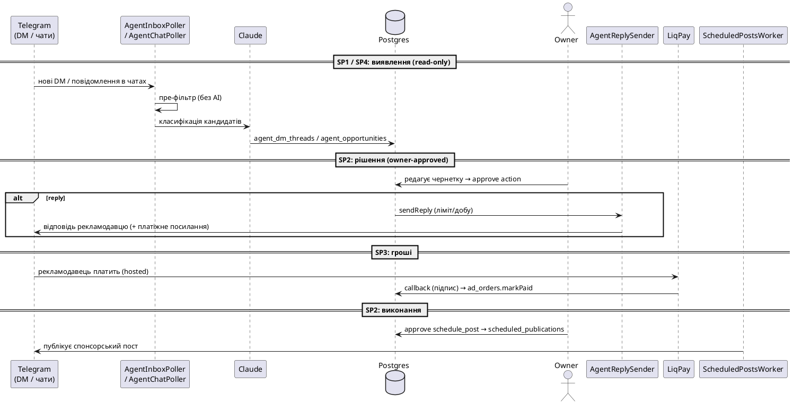

# 04 · Агент-оператор (монетизація SP1–SP4)

Це найновіша підсистема (`apps/automation/src/agent` + `apps/automation/src/payments`) — те, що перетворює аудиторію на гроші. Головний принцип: **«агент пропонує → власник апрувить»**. Нічого зовнішнього/фінансового не відбувається автономно.

## 4.1 Фундаментальні інваріанти (перевірені grep-ом)

| Інваріант | Як тримається |
|---|---|
| **Read-only, крім явного апруву** | надсилання DM існує ЛИШЕ в `agent-reply-sender.service.ts`, викликається лише з approve-ендпоінта |
| **Ізольований акаунт** | окрема MTProto-сесія з `role='agent'` (окремо від tracker/publishing) — бан агента не валить публікацію |
| **Без авто-вступу** | у модулі `agent` **немає** методів `joinChannel`/`ImportChatInvite` — лише вже-додані чати |
| **Off by default** | `AGENT_ENABLED=false`, `AGENT_CHAT_ENABLED=false` |
| **Захист AI-вартості** | пре-фільтр (`isOpportunityCandidate`) відсіює балачки **перед** будь-яким викликом Claude |

## 4.2 Чотири етапи

### SP1 — DM-інбокс (read-only тріаж)
`AgentInboxPoller` (@Cron `*/5m`, gated) читає нові вхідні DM агент-сесії → `AgentTriageService` (1 дешевий Claude-виклик) класифікує `ad | vp | question | spam | other`, робить підсумок, витягує поля (канал/бюджет/дати) і **чернетку відповіді** → `agent_dm_threads`. Дашборд `/app/agent`. **Нічого не надсилає.**

### SP2 — Дії за апрувом
Уніфікована черга `agent_actions` (тип `reply` або `schedule_post`). Власник у «Pending actions» редагує й **апрувить**:
- `reply` → `AgentReplySender` шле DM з агент-акаунта (з денним лімітом `AGENT_REPLY_DAILY_CAP`, перевіряється **до** надсилання);
- `schedule_post` → вставка в наявну чергу `scheduled_posts`.
Approve **ідемпотентний** (не-pending дія — no-op, без задвоєного надсилання).

### SP3 — Оплата (LiqPay)
`ad_orders` (інвойс). `POST /ad-orders/:id/checkout` → підписані LiqPay-параметри (сума береться **серверно** з рядка, не з клієнта) → власник шле посилання рекламодавцю. **Публічний** `POST /api/payments/liqpay/callback` перевіряє **підпис** (не auth-гард) → `markPaid` (ідемпотентно). Hosted-only: карток ми не бачимо.

### SP4 — Розвідка чатів (read-only стрічка)
`AgentChatPoller` (@Cron `*/15m`, gated, cap 20) для кожного увімкненого **вже-доданого** чату читає нові повідомлення → пре-фільтр → кандидати класифікує (`ad_offer | vp_request | pricing | other` + оцінка + порада) → `agent_opportunities`. Діяти — через SP2/SP3.

## 4.3 Повна петля монетизації (sequence)

## 4.4 Що це дає бізнесу і де межа

**Дає:** структуровану воронку «запит → відповідь → оплата → публікація», де кожен ризиковий крок (надсилання, гроші) під контролем людини, а рутина (тріаж, класифікація, чернетки, виявлення можливостей) автоматизована.

**Межа (чесно):**
- це **не** автономна рекламна біржа — усе впирається в апрув власника;
- надсилання з агент-акаунта додає **write-патерн** на MTProto-акаунт (ризик бану, хоч і на ізольованому акаунті);
- `AGENT_REPLY_DAILY_CAP` капає кількість, але агент FLOOD_WAIT **не має backoff** (лише лог) — сталий флуд-вейт довший за інтервал крону = повторні невдалі спроби щотіку (див. [05](05-strengths-weaknesses-risks.md));
- монетизація існує, але **дохід ≠ код**: він = час і рішення власника.
